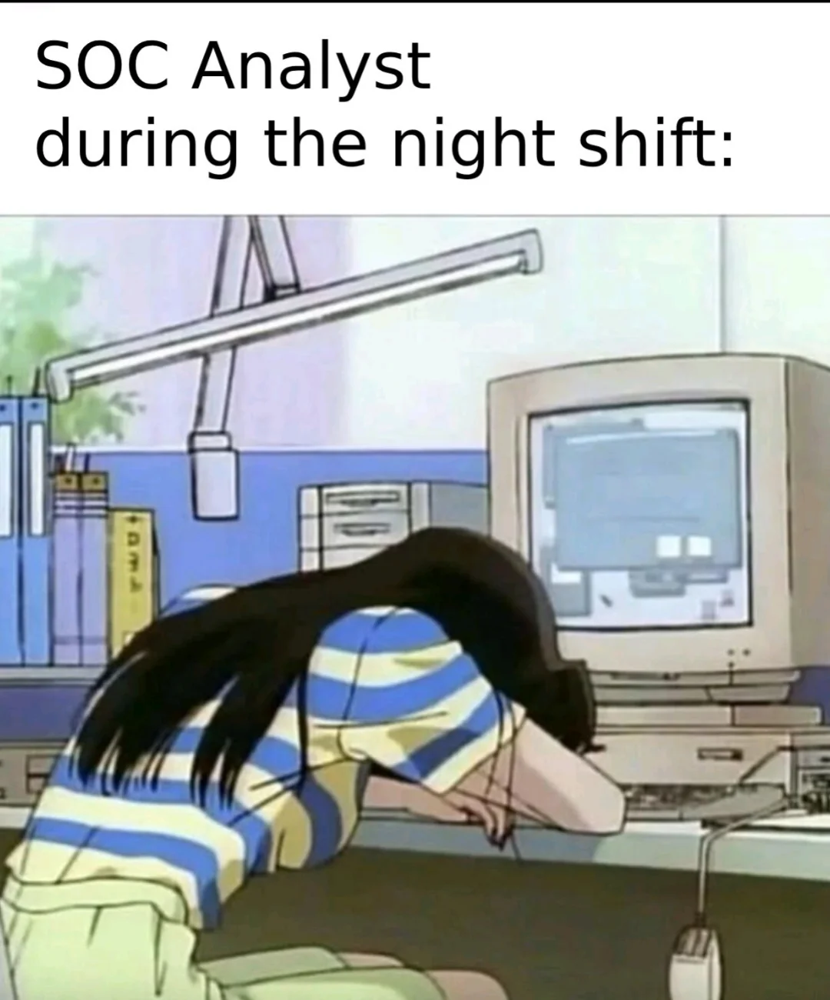

## 🔹 Для чего этот раздел?

Я решил конспектировать свои решения тачек в Hacker Lab. Думаю, это будет очень полезно для тех, кто только начинает свой путь в ctf и хочет разобраться в принципах и подходах в решениях тасок. Флаги я не раскрываю намеренно - пусть все будет честно:) Также планирую записывать видео-разборы с более подробными и живыми объяснениями.

Ссылочка будет тут ->

Приятного прочтения!

