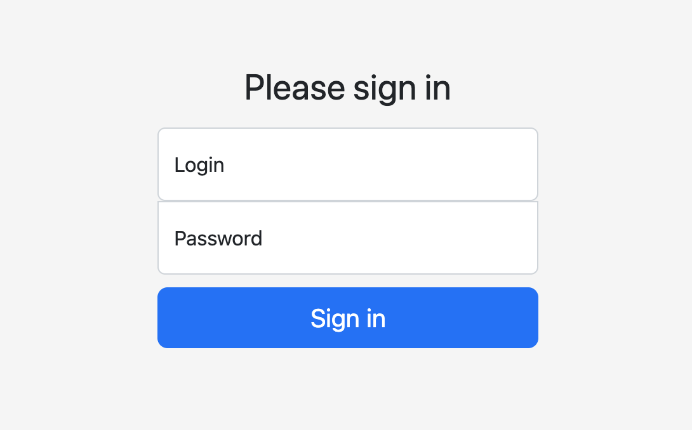
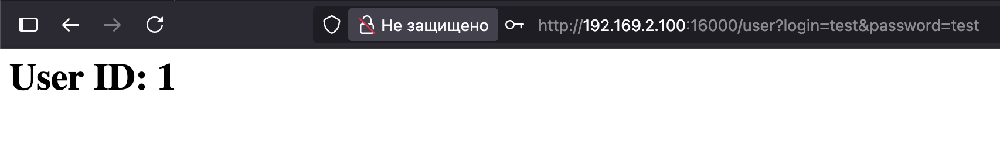
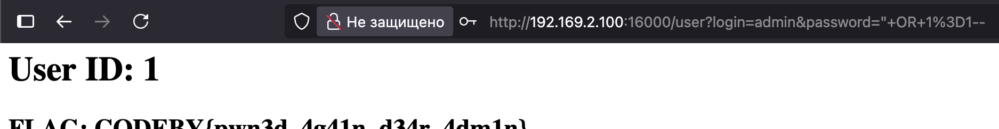

## 🔹 Базовая авторизация

Разбор всех комнат codeby я решил начать именно с этой - будем идти по возрастающей. Задание не сильно сложное - для новичков самое то.

Итак, перед нами простая форма авторизации - и нам дали тестовые креды для входа в систему.

После входа нас встречает почти пустая страничка с номером id нашего пользователя. 

Теперь будем думать, как нам выбраться в учетку админа. При взгляде на форму авторизации лично у меня возникает мысль - было бы классно потестить ее на SQL-инъекции. Что это такое! Давай разберемся.

## 🔹 SQL-Инъекции

**SQL-инъекция** — это уязвимость в веб-приложениях, которая позволяет злоумышленнику вмешиваться в запросы, которые приложение отправляет в базу данных.

Представь, что у тебя есть сайт с формой логина (прямо как в нашем случае). Ты вводишь `логин` и `пароль`, а сайт на сервере проверяет их в базе данных с помощью такого SQL-запроса:

> SELECT * FROM users WHERE username = 'введенный_логин' AND password = 'введенный_пароль';

Если в базе есть такой пользователь с таким паролем — он входит в систему. А теперь представь, что вместо логина злоумышленник вводит вот такую строку:  

`admin' --`

Тогда запрос на сервере превратится в это:

> SELECT * FROM users WHERE username = 'admin' -- ' AND password = 'любой_пароль';

**Что здесь произошло?**

- Символ `'` закрыл кавычки от логина.
- `--` в SQL — это комментарий. Всё, что идет после него, **игнорируется**.
- В результате запрос проверяет только логин `admin` и **полностью игнорирует проверку пароля**.

Система найдет пользователя `admin` и пропустит его внутрь, без знания пароля.

Попробуем провернуть это и для нашего задания. Введем в поле логин admin, а в поле пароля `" OR 1=1--`. И у нас получается войти в систему! 

