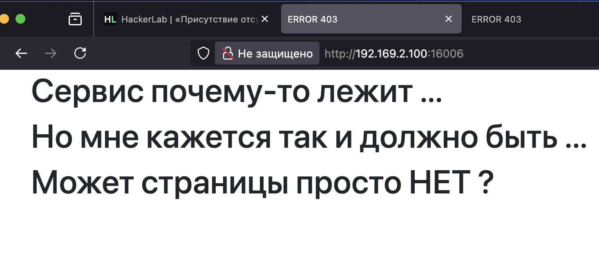
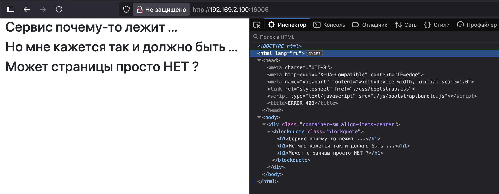
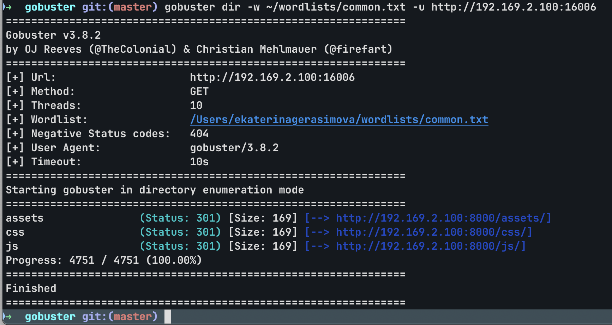
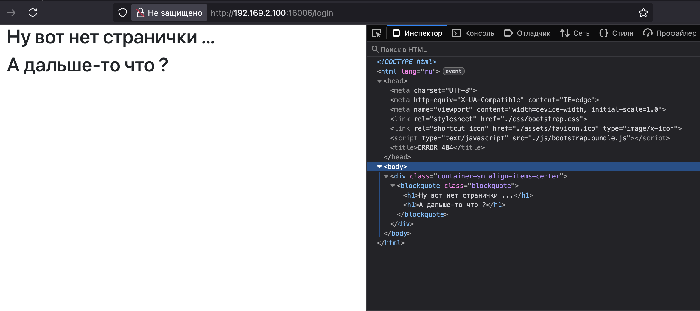
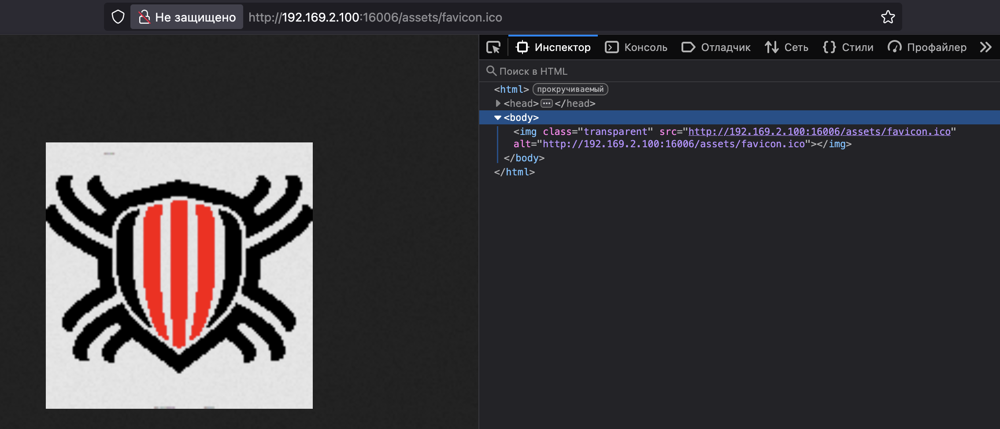
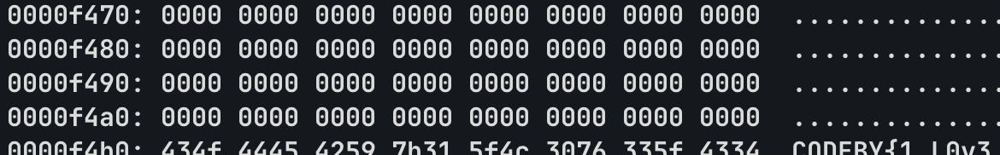

## 🔹 Присутствие отсутствия 
Еще одно небольшое, но интересное задание. На этот раз (спойлер) оно больше на внимательность, нежели на знание каких-то уязвимостей. Начнем! Итак - перед нами пустая страница сайта, а текст задания гласит - "Кто-то сломал сервер. Вот только он не сдается и еще как-то отдает странички. Странно, что одна страничка пострадала меньше. Посмотри пожалуйста, что же на ней такого."

Открыв исходную страницу сайта видим такое:

Что ж, неприятненько, интерактивных элементов нет, может быть что-то будет в исходном коде страницы? Открываем инспектор и смотрим.

Чего-то интересного тут нет, поэтому предлагаю воспользоваться gobuster, чтобы попытаться найти скрытые директории или файлы. В качестве вордлиста я буду использовать common.txt - небольшой файлик с общими названиями. Для задания уровня легко как будто должно хватить.

Запускаем и..... ничего :( 

Не будем отчаиваться и попробуем наугад перейти на какую-нибудь страничку - например на login

Сработало - мы получили другую страничку, теперь давай изучим ее поподробнее. Если сопоставить исходный код обеих страниц, то можно заметить, что во второй - есть иконка. 

Выглядит она весьма дефолтно, но других идей у меня особо нет - больше разницы между станицами я не заметил.

Давай качнем ее на комп и попробуем поковырять. Для этого перейдем в url по пути, который указан в коде старницы.

Вот и она - качаем ее себе и думаем, что с ней можно сделать. Первое, что мне бросилось в глаза при открытии - какие-то странные пиксели вверху и внизу картинки, какой-то другой цвет. 

Давай посмотрим на бинарный код картинки через утилиту xxd (это для мака, для линухи можно использовать less). 

Мотаем бинарный код и в конце видим наш флаг, браво!

