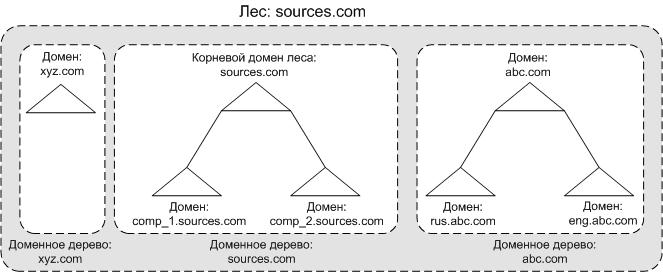
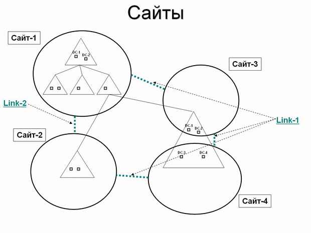
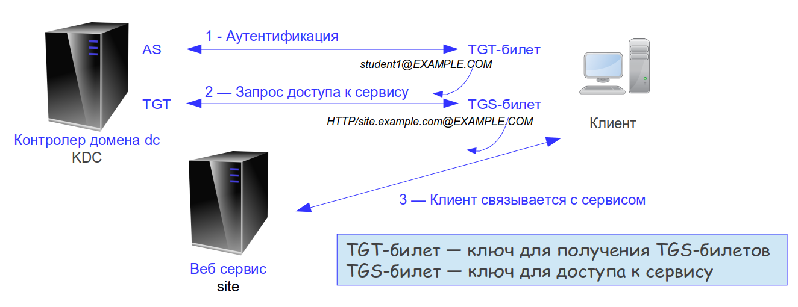

#AD, LDAP, KERBEROS
## 🔹 Авторизация, идентификация и аутентификация

>**Идентификация** – это процедура распознавания субъекта по его идентификатору

>**Аутентификация** – это процедура проверки подлинности

Как можно проходить аутентификацию:

- Пароль – то, что мы знаем (слово, PIN-код, код для замка, графический ключ)

- Устройство – то, что мы имеем (пластиковая карта, ключ от замка, USB-ключ)

- Биометрика – то, что является частью нас (отпечаток пальца, портрет, сетчатка глаза)

>**Авторизация** – это предоставление доступа к какому-либо ресурсу

Все три процедуры взаимосвязаны:

- Сначала определяют имя (логин или номер) – идентификация

- Затем проверяют пароль (ключ или отпечаток пальца) – аутентификация

- И в конце предоставляют доступ – авторизация

## 🔹 LDAP

>**Протокол LDAP (Lightweight Directory Access Protocol)** — легковесный протокол для доступа к службе сетевого каталога. Использует протокол 389. С расширением шифрования SSL - 636

**Сетевые каталоги** (службы каталогов) - средство иерархического представления ресурсов, принадлежащих некоторой отдельно взятой организации, и информации об этих ресурсах. Под ресурсами могут пониматься: пользователи и группы, файлы и каталоги, сетевые ресурсы и т.д.

Основной единицей информации, хранимой в каталоге, является отдельная запись (entry). Каждая запись представляет какой-либо реальный объект: человека, компьютер, организацию и т.д. Запись описывает объект через набор присущих ему атрибутов. Атрибуты представляют собой пары вида «имя — значение». Фактическое значение атрибута зависит от его типа.

Записи в службе каталогов хранятся в иерархической структуре, называемой «Информационное дерево каталога»  (Directory information tree - DIT) Обращение к записям осуществляется по их уникальным именам (DN, distinguished name). DN - это специальный атрибут каждого объекта, он включает полный путь к записи от корня DIT и этим напоминает путь к файлу в файловой системе.

Операции протокола LDAP:
1. Операции запроса информации.
    - Search - запрос поиска по дереву каталога сервера.
    - Compare - сравнение утверждения с записью в каталоге на сервере.
2. Операции изменения информации.
    - Add - запрос на добавление объекта в каталог сервера.
    - Delete - запрос на удаление объекта из каталога сервера.
    - Modify - запрос модификации объекта на сервере.
    - Rename - запрос переименования объекта на сервере.
3. Операции аутентификации и управления.
    - Bind - передача аутентификационной информации от клиента к серверу.
    - Unbind - завершение сессии работы протокола.
    - Abandon - возможность создания запроса на прерывание сервером выполняющейся операции.
Для общего развития можно почитать про OpenLdap

## 🔹 ACTIVE DIRECTORY

> **Active Directory** (AD) - служба каталогов от компании Microsoft, предназначена для централизации управления сетями Windows.

**Основные понятия AD**

1) **Домен** — основная единица системы безопасности AD

2) **Контроллер домена** — сервер, хранит соответствующую этому домену часть глобального каталога.

4) **Глобальный каталог** — перечень всех объектов AD и их свойств.

5) **Схема каталога** — набор определений всех типов объектов каталога и связанных с ними атрибутов.

**Основные функции AD**

1) Хранение базы данных каталога AD

2) Синхронизация изменений в AD

3) Авторизация пользователей.

**Структура AD**

## 🔹 Логическая структура:

>**Домен** — логическая часть каталога, которая поддерживает централизованное управление.

>**Дерево** — набор доменов, которых связывает отношение дочерний-родительский, а также связанны пространства имён.

>**Лес** — Одно или несколько деревьев, которые разделяют общую схему глобального каталога. В лесу все домены объединены двусторонними доверительными отношениями.

**Физическая структура:**

**Сайт** — группа IP-сетей, соединённых между собой быстрыми и надёжными коммуникациями.

**Протокол RPC в AD:** 

RPC — это протокол, который позволяет программам на одном компьютере вызывать процедуры (или функции) на другом компьютере, как если бы они были локальными. В среде Active Directory RPC используется для:

1. Коммуникации между контроллерами домена: Контроллеры домена используют RPC для обмена информацией о состоянии и репликации данных AD.
2. Обслуживания клиентских запросов: Когда клиентские приложения, такие как Windows, обращаются к Active Directory для аутентификации или получения информации о пользователях и группах, они используют RPC для выполнения этих операций.
3. Управления объектами: Администраторы могут использовать инструменты, такие как Active Directory Users and Computers, которые также полагаются на RPC для выполнения операций управления объектами.

Для репликации между сайтами кроме RPC может использоваться также протокол SMTP, данные при передаче сжимаются (в результате сетевой трафик составляет от 10 до 40% от первоначального значения), передача изменений происходит по определенному расписанию. Если имеется несколько маршрутов передачи данных, то система выбирает маршрут с наименьшей стоимостью.

## 🔹 GROUP POLICY (Групповые политики)

>**Групповые политики** позволяют настраивать различные параметры компьютеров и пользовательской рабочей среды сразу в масштабах сайта AD, домена, организационного подразделения (детализацию настроек можно проводить вплоть до отдельного компьютера или пользователя). Настраивать можно широкий набор параметров — сценарии входа в систему и завершения сеанса работы в системе, параметры Рабочего стола и Панели управления, размещения личных папок пользователя, настройки безопасности системы (политики паролей, управления учетными записями, аудита доступа к сетевым ресурсам, управления сертификатами и т.д.), развертывания приложений и управления их жизненным циклом.

**Централизованная настройка:**

1. Конфигурации компьютеров
2. Пользовательской среды
3. Сценариев (вход в систему, загрузка компьютера)
4. Развёртывания приложений
5. Безопасности системы (политики паролей, аудит, управления учётными записями и т.д.)

Каждый объект политик содержит два раздела: конфигурация компьютера и конфигурация пользователя. Параметры этих разделов применяются соответственно либо к настройкам компьютера, либо к настройкам среды пользователя.

Каждый объект политик может быть привязан к тому или иному объекту AD — сайту, домену или организационному подразделению (а также к нескольким объектам одновременно).

**Сервер сценариев Windows** (англ. Windows Script Host, WSH) — компонент Microsoft Windows, предназначенный для запуска сценариев на скриптовых языках JScript и VBScript, а также и на других дополнительно устанавливаемых языках (например, Perl).

## 🔹 Сквозная авторизация

>**Single Sign-On (SSO)** — это механизм, позволяющий пользователю пройти аутентификацию (вход со своими учетными данными) единовременно и получить доступ к различным программным продуктам, используя один идентификатор.

**Основные понятия:**

>**Realm** — область действия (в нашем случае - домен).

>**Principal** — строка, полностью идентифицирующая участника протокола Kerberos.

>**UPN** (User Principal Name) — уникальный в лесу идентификатор пользователя (UserPrincipalName).

Вид: _principal-name[/instance-name]@REALM_  
Пример: _`student1@EXAMPLE.COM`_

**SPN** (Service Principal Name) — уникальный идентификатор сервиса, должен быть привязан к учётной записи в AD.

Вид: _service-name/host[:port]@REALM_  
Пример: _`HTTP/site.example.com@EXAMPLE.COM`_

## 🔹 Работа сквозной авторизации в KERBEROS

>**KDC** (Key distribution center) — центр распространения ключей, состоит из:

- сервер аутентификации AS;
- сервер выдачи разрешений TGT;
- база данных Kerberos (в AD в качестве базы данных используется собственный каталог, основанный на OpenLDAP).

Работа клиента с KDC происходит таким образом:

