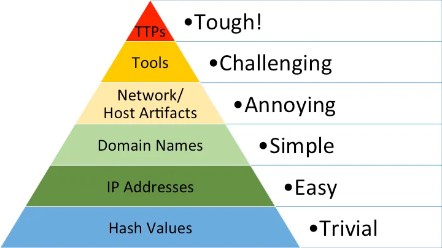
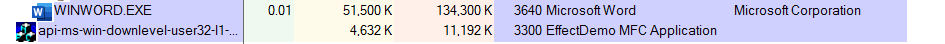
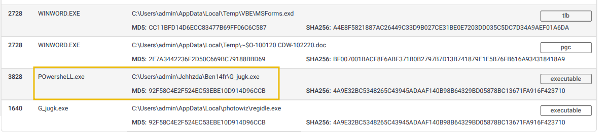
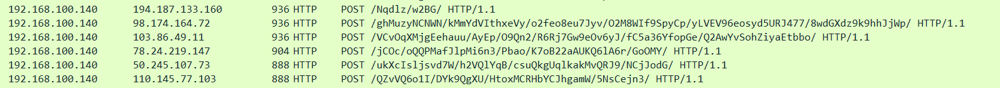
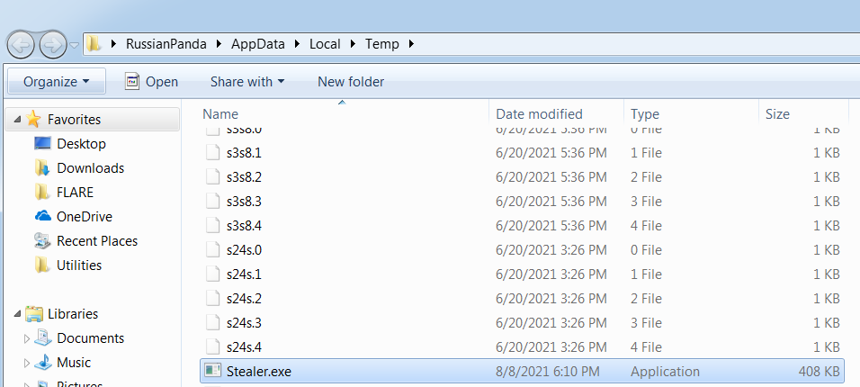
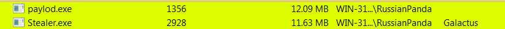

# 🔹 Пирамида боли

> **«Пирамида боли»** — это концепция, предложенная аналитиком в области информационной безопасности Дэвидом Бьянко.

Она **описывает уровни сложности индикаторов компрометации**, которые злоумышленники используют при атаках.

**Пирамида боли содержит шесть уровней**, от «наименее болезненных» до «наиболее критических» индикаторов. Она отражает то, насколько большие проблемы защитники могут создать злоумышленникам путём борьбы с теми или иными сущностями.

## 🔹 Hash Values (Trivial)

Согласно Microsoft, хеш-значение представляет собой числовое значение фиксированной длины, которое однозначно идентифицирует данные. Значение хеша - результат алгоритма хеширования. Хеш не считается криптографически безопасным, если два файла имеют одинаковое значение хеша или дайджеста (такая ситуация называется коллизией). Невозможно полностью избавиться от коллизий, поэтому безопасным считается та хеш функция, которая очень редко выдает коллизии. Специалисты по безопасности обычно используют хеш-значения, чтобы получить представление о конкретном образце вредоносной программы, вредоносном или подозрительном файле, а также как способ уникальной идентификации и ссылки на вредоносный артефакт.

Для поиска хешей можно использовать такие инструменты как [Virus Total](https://www.virustotal.com/gui/home/upload) и [OPSWAT](https://www.opswat.com/).

Как вы могли заметить, достаточно легко обнаружить вредоносный файл, если у нас есть его хеш. Однако, злоумышленник может модифицировать файл, и даже добавив один бит, создать другое значение хеша. С таким количеством вариаций, охота с использованием хешей  как IOC'ов (Индикатор компрометации) может стать затруднительной.

## 🔹 IP Address (Easy)

 IP-адрес используется для идентификации любого устройства, подключенного к сети. Мы полагаемся на IP-адреса для отправки и получения информации по сети. Но мы не собираемся вдаваться в структуру и функциональность IP-адреса. В рамках Пирамиды боли мы оценим, как IP-адреса используются в качестве индикатора.

С точки зрения защиты, знание IP-адресов, которые использует противник, может быть ценным. Общая тактика защиты заключается в блокировке или отказе во входящих запросах с IP-адресов. Эта тактика часто не является "сильной", поскольку опытному противнику легко возобновить атаку, просто используя новый публичный IP-адрес. Также существует иной способ обойти нашу защиту.

> **Fast Flux** — **технология, позволяющая киберпреступникам скрывать IP‑адреса своих серверов при помощи манипуляции параметрами DNS**.

Fast Flux использует легитимную возможность привязывать к одному доменному имени несколько IP-адресов. Злоумышленники постоянно меняют их, каждый раз подставляя в качестве физического сервера одно из входящих в ботнет устройств.

## 🔹 Domain Names (Simple)

>**Punycode-атака** — это использование Punycode для маскировки фишинговых сайтов, которые выдают себя за легитимные ресурсы. 

**Punycode** — это способ кодировать символы Unicode, которые не входят в стандартный набор ASCII. С его помощью браузеры легче интерпретируют такие символы, как кириллические буквы, акцентированные латинские символы и даже эмодзи. 

**Как работает Punycode-атака**: злоумышленники подменяют обычные буквы в веб-адресе на символы Unicode, которые выглядят почти идентично. Например, домен «xn--80ak6aa92e.com» в некоторых браузерах выглядит как «apple.com».
## 🔹 Host Artifacts (Annoying)

Если вы обнаружите атаку на этом уровне, злоумышленник будет сильно недоволен, поскольку ему нужно будет заново возвращаться на этот уровень, с уже измененным арсеналом инструментов. Почему? Потому что на этом уровне выявляются так называемые "Артефакты хоста".

> **Артефакты хоста** - это следы или другая активность, которую злоумышленники оставляют в системе, такие как значения реестра, подозрительное выполнение процесса, шаблоны атак или IOC, файлы, сброшенные вредоносными приложениями, или что-либо исключительное для текущей угрозы.

Например - подозрительное выполнение процесса из Word:

Или файлы, сброшенные злоумышленником, для последующих этапов атаки:

## 🔹 Network Artifacts (Annoying)

Сетевые Артефакты также относятся к желтой зоне в Пирамиде боли. Это означает, что если вы сможете обнаружить и ответить на угрозу, злоумышленнику потребуется больше времени, чтобы вернуться и изменить свою тактику или инструменты, что дает вам больше времени для реагирования и обнаружения предстоящих угроз или исправления существующих.

Сетевой артефакт может быть строкой User-Agnet, C2 информация, или URI шаблоны, за которыми следуют HTTP POST запросы. Атакующий может использовать строку User-Agent, которая не наблюдалась в вашей среде раньше или кажется необычной. User-Agent определяется в [RFC2616](https://datatracker.ietf.org/doc/html/rfc2616#page-145) как поле запроса-заголовка, которое содержит информацию об агенте пользователя, инициирующем запрос.

Например - HTTP POST запросы с подозрительными ссылками:

## 🔹 Tools (Challenging)

Если мы обнаружим злоумышленника на данном этапе, то он, скорее всего, откажется от попыток взломать вашу сеть или вернуться и попытаться создать новый инструмент. Это будет достаточно трудно для злоумышленника, поскольку ему нужно будет вложить деньги в создание нового инструмента, найти инструмент, который имеет тот же потенциал, или потратить время на подготовку атаки, чтобы научиться владеть определенным инструментом. 

Злоумышленники будут использовать утилиты для создания вредоносных макродокументов (maldocs), для попыток шпионажа, бэкдора, который можно использовать для установления C2 (Command and Control), самописные EXE, и DLL файлы или взломщики паролей.

 [SOC Prime Threat Detection Marketplace](https://tdm.socprime.com/)

Например - **Троян оставил подозрительный "Stealer.exe" в папке Temp:**

Выполнение вредоносного бинарника:

## 🔹 TTPs (Tough)

Наконец-то - мы дошли до вершины Пирамиды боли! TTP означает Тактику, Техники и Процедуры. По сути, это включает в себя всю [MITRE ATT&CK MATRIX](https://attack.mitre.org/), что означает все шаги, предпринятые противником для достижения своей цели, начиная с попытки фишинга и утечки данных.

Например - можете почитать о [атаке китайской хакерской группировки Chimera.](https://attack.mitre.org/groups/G0114/) Там указаны все шаги атаки с конкретными техниками их матрицы митры.

