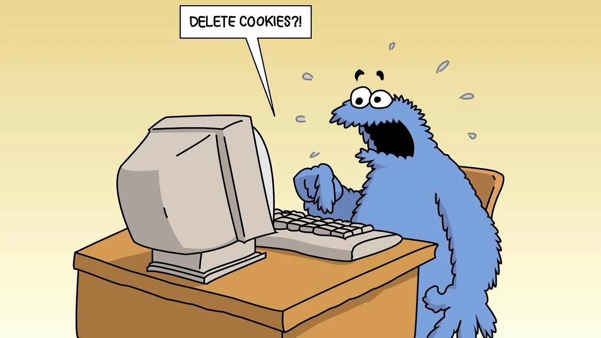

# Clien Side

Прежде всего пройдемся по тому, благодаря чему работают Client-Side уязвимости. 

[Видео-лекция](https://www.youtube.com/watch?v=pav484YYnCU) по которой сделан конспект.

## 🔹 XML

> XML - язык разметки для представления и передачи структурированных данных. Он нужен для универсального представления информации в форме, пригодной для обмена между различными системами, веб-службами и приложениями.

XML используется, например в sitemap. Sitemap - это файл, который содержит список всех страниц веб-сайта, доступных для индексации поисковыми системами. Он помогает поисковым системам, таким как Google, Bing и другим, лучше понимать структуру сайта и находить его контент. Также xml есть в ворде.

## 🔹 XXE

> XXE - это атака на XML парсер, связанная с обработкой внешних сущностей в xml-документах.

Эта атака связана с неправильной обработкой внешних сущностей. Какие есть последствия XXE?

- SSRF
- File read
- DOS (рекурсивно включаем сущности и происходит перегруз)
- Directory read
- RCE

Как можно бороться с XXE - отключать поддержку внешних сущностей. И использовать библиотеки, которые фильтруют данные перед парсингом XXE документов.

## 🔹 Client-Side

Про Server-Side мы уже поговорили в прошлом конспекте - теперь поговорим о Client-Side.

> Client-Side - уязвимости, которые эксплуатируются на стороне клиента, которые могут быть обнаружены на стороне клиента. То есть на устройстве конечного пользователя, таком как компьютер, смартфон или планшет. Эти уязвимости тесно связаны с веб-приложениями и браузером.

## 🔹CSRF

> CSRF - это атака на пользователя, при которой злоумышленник заставляет пользователя выполнить нежелательное действие на веб-сайте от имени пользователя. 

Атака происходит путем введения пользователя в выполнение запроса (обычно HTTP) без его явного согласия.

Как может происходить такая атака? Предположим, что вы вошли в свою учетную запись интернет-банка, и браузер хранит вашу сессию. Злоумышленник создает страницу с кодом, который отправляет запрос на перевод денег с вашего счета на счет злоумышленника. 

Когда вы посетите эту страницу, ваш браузер автоматически отправит запрос на перевод средств в интернет-банке, так как вы уже аутентифицированы. В результате средства будут переведены на счет злоумышленника, и вы даже не заметите этого.

Какие есть последствия у CSRF?

- Угон аккаунта

- Выполнение какой-то функциональности от имени другого пользователя

Как защищаться?

1) Использовать SameSite - механизм, который показывает браузеру, как ему передавать куки в рамках cross-site запросов.

2) Использовать CSRF-токен. Когда мы хотим что-что изменить или отправить, то отправляется еще и CSRF-токен.

3) Использовать хорошие веб фреймворки с поддержкой блокировок попыток CSRF.

## 🔹XSS (Cross-Site Scripting)

XSS — это уязвимость, которая позволяет злоумышленнику вставлять вредоносный скрипт в веб-страницу, которую видит другой пользователь. Это может привести к различным атакам, таким как кража сессионных куков, подмена содержимого страницы или перенаправление пользователей на фишинговые сайты. Существует несколько типов XSS:

1. Отраженный XSS: Вредоносный скрипт передается через URL или форму, и выполняется на стороне клиента, когда пользователь открывает ссылку или отправляет форму.
  
2. Сохраненный XSS: Вредоносный код сохраняется на сервере (например, в базе данных) и затем отображается другим пользователям, когда они запрашивают уязвимую страницу.

3. DOM-based XSS: Уязвимость возникает из-за манипуляций с Document Object Model (DOM) на стороне клиента, где скрипт изменяет содержимое страницы без взаимодействия с сервером.

Пример XSS атаки:

Предположим, что веб-сайт позволяет пользователям оставлять комментарии, но не фильтрует ввод. Злоумышленник может оставить следующий комментарий:

``

Когда другой пользователь откроет страницу с этим комментарием, скрипт выполнится в его браузере, и злоумышленник может использовать его для кражи куки-файлов или выполнения других действий.

## 🔹HttpOnly Cookie

> HttpOnly cookie — это тип куки, который имеет специальный флаг, указывающий браузеру, что этот куки не должен быть доступен через JavaScript. Это помогает защитить куки от атак типа Cross-Site Scripting (XSS), когда злоумышленник может попытаться получить доступ к кукам через вредоносный скрипт.

Когда сервер отправляет куки клиенту, он может установить флаг HttpOnly. При установленном флаге HttpOnly браузер запрещает доступ к этому куки через объект document.cookie. Это означает, что скрипты, запущенные на странице, не могут читать или изменять этот куки.

Но! В некоторых случаях веб-приложения требуют доступ к кукам через JavaScript. Например, если куки содержат данные, которые должны быть динамически изменены или прочитаны на клиентской стороне (например, пользовательские настройки), использование HttpOnly будет невозможным. Еще При отладке проблем с аутентификацией или сессиями разработчики могут захотеть проверить значения куков. Если куки помечены как HttpOnly, это может усложнить процесс отладки.

Хотя HttpOnly помогает защититься от XSS-атак, он не является единственным средством защиты. Важно использовать и другие меры безопасности, такие как Content Security Policy (CSP), защита от CSRF и другие механизмы аутентификации и авторизации.

## 🔹XSS CSP

CSP — это механизм безопасности, который помогает предотвратить XSS-атаки и другие инъекции путем определения, какие ресурсы могут быть загружены и выполнены на веб-странице. Он позволяет администраторам сайта контролировать источники контента, такие как скрипты, стили, изображения и т.д. CSP реализуется с помощью HTTP-заголовка Content-Security-Policy.

Как CSP помогает предотвратить XSS?

1. Можно создать запрет на inline скрипты. CSP может запрещать выполнение inline скриптов, что значительно снижает риск XSS. Запрет на inline скрипты в контексте Content Security Policy (CSP) — это механизм, который позволяет ограничить выполнение JavaScript-кода, встроенного непосредственно в HTML-документ. Inline скрипты — это те скрипты, которые написаны непосредственно внутри тега `<script>` или атрибута `onclick`, `onload` и других.
  
2. Включить контроль источников. CSP позволяет ограничить источники, откуда могут загружаться скрипты и другие ресурсы, что затрудняет злоумышленникам вставку вредоносного кода.

3. Отладка и мониторинг! CSP может быть настроен для ведения журналов нарушений (reporting), что позволяет разработчикам отслеживать попытки эксплуатации уязвимостей.