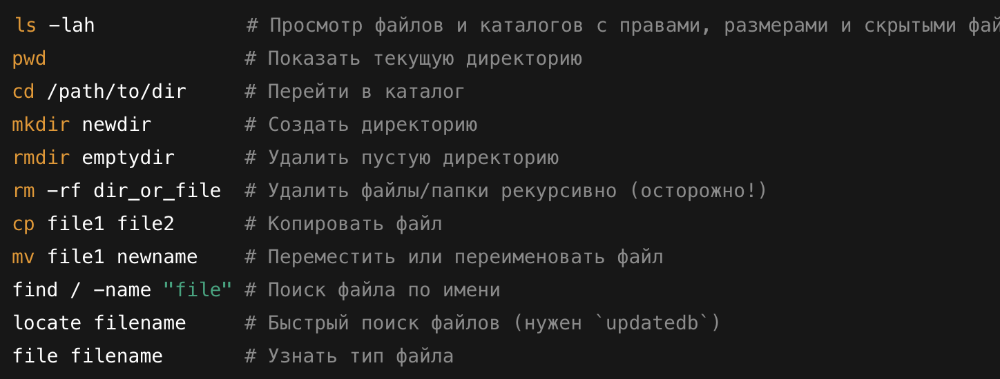
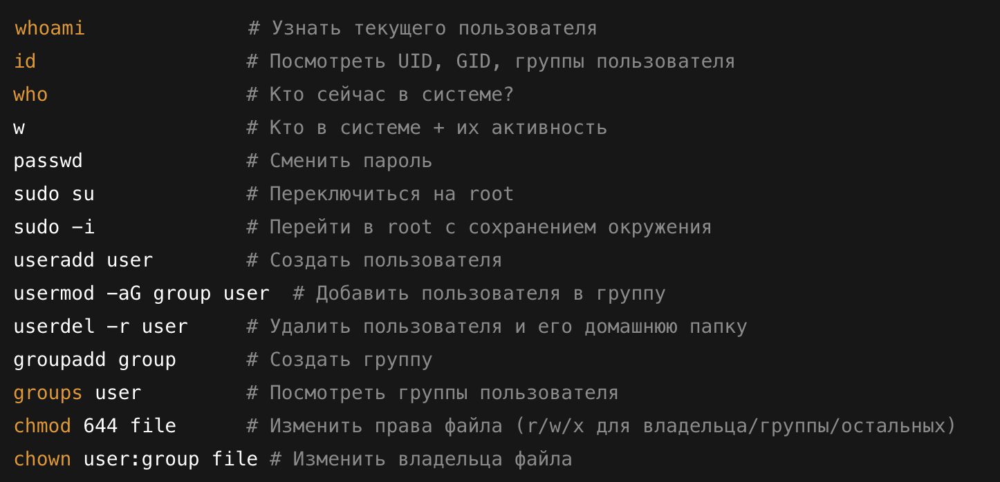
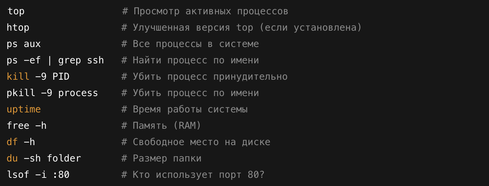
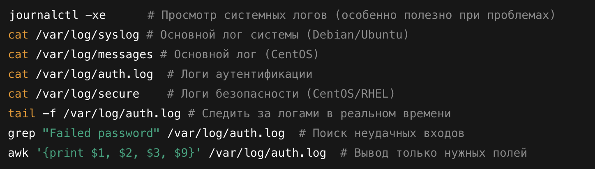
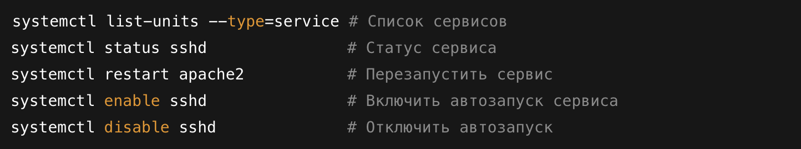
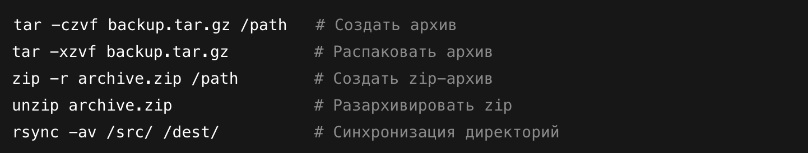
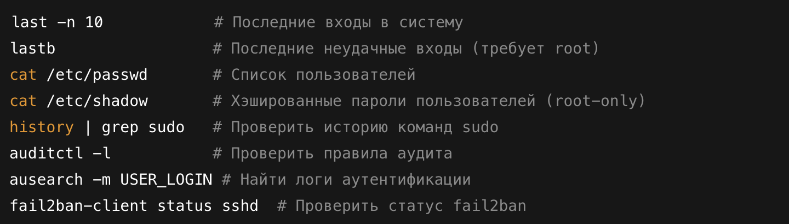

# Основы Linux (директории, команды)

## 🔹 Основные директории Linux

📍 **`/` (root, корневая директория)**  
Главная директория, с неё начинается вся файловая система.

📍 **`/bin` (binaries, исполняемые файлы)**  
Содержит базовые команды (`ls`, `cat`, `cp`, `mv`, `rm`, `bash`), которые нужны для работы системы.

📍 **`/sbin` (system binaries, системные исполняемые файлы)**  
Здесь находятся утилиты для администрирования (`fsck`, `reboot`, `iptables`, `ifconfig`).

📍 **`/etc` (configuration, конфигурационные файлы)**  
Хранилище конфигурационных файлов системы и программ. Например:

- `/etc/passwd` – список пользователей
- `/etc/shadow` – пароли пользователей
- `/etc/hosts` – таблица соответствий IP-адресов и доменов

📍 **`/home` (домашние директории пользователей)**  
Каждый пользователь имеет свою папку (`/home/user`), где хранятся его файлы и настройки.

📍 **`/root` (домашняя директория root-пользователя)**  
Это **не** `/`, а именно `/root`. Здесь root хранит свои файлы.

📍 **`/var` (variable, изменяющиеся данные)**  
Для логов, временных файлов и данных сервисов:

- `/var/log` – журналы системы (`auth.log`, `syslog`)
- `/var/tmp` – временные файлы
- `/var/lib` – данные сервисов (например, базы данных)

📍 **`/tmp` (temporary, временные файлы)**  
Файлы, которые удаляются после перезагрузки.

📍 **`/usr` (user system resources, системные утилиты и программы)**  
Используется для хранения программ и библиотек:

- `/usr/bin` – исполняемые файлы обычных пользователей
- `/usr/sbin` – исполняемые файлы админов
- `/usr/lib` – библиотеки
- `/usr/local` – софт, установленный вручную

📍 **`/opt` (optional, дополнительные программы)**  
Для установки стороннего ПО, которое **не входит в стандартные репозитории**. Например, сюда можно установить Telegram или Chrome.

📍 **`/dev` (devices, устройства)**  
Файлы устройств:

- `/dev/sda` – жёсткие диски
- `/dev/null` – "чёрная дыра" (данные, отправленные сюда, исчезают)
- `/dev/tty` – терминалы

📍 **`/mnt` и `/media` (mount, точки монтирования)**  
Используются для временного подключения файловых систем:

- `/mnt` – ручное монтирование
- `/media` – для автоматического монтирования флешек, дисков

📍 **`/proc` (процессы, виртуальная ФС)**  
Хранит информацию о запущенных процессах и параметрах системы в виде файлов:

- `/proc/cpuinfo` – данные о процессоре
- `/proc/meminfo` – информация о памяти
- `/proc/[PID]` – информация о конкретном процессе

📍 **`/sys` (системная информация, драйверы и устройства)**  
Похоже на `/proc`, но используется для взаимодействия с ядром.

📍 **`/boot` (загрузочные файлы системы)**  
Содержит ядро (`vmlinuz`), загрузчик (`grub`), initrd и другие файлы, нужные для загрузки системы.

📍 **`/lib` и `/lib64` (библиотеки для программ и ядра)**  
Системные библиотеки для `/bin` и `/sbin`, включая модули ядра.

## 🔹 Советы для собеседования

**Важно знать назначения папок** – могут спросить про `/etc`, `/var`, `/tmp`.

**Уметь искать файлы:**
`find / -name "config.conf"`
`locate config.conf`

**Посмотреть, что в директории:**

`ls -lah /var/log`

**Вывести информацию о системе**:

`uname -a`
`df -h`
`cat /etc/os-release`

## 🔹 Шпаргалки!

## 🔹 **Работа с файлами и каталогами**

## 🔹 **Управление пользователями и правами**

## 🔹 **Мониторинг процессов и ресурсов**

## 🔹 **Анализ логов**

## 🔹 **Сетевые команды (SOC MUST-KNOW)**

## 🔹 **Работа с службами и запущенными процессами**

## 🔹 **Работа с бэкапами и архивацией**

## 🔹 **SOC L1 Специфические команды**

## 🔹 Что почти точно могут спросить на собесе?

Как узнать активные соединения в системе? - `netstat -antp`

Как найти все неудачные попытки входа? - `grep "Failed password" /var/log/auth.log`

Как узнать, кто подключен по SSH? - `who`, `w`, `last -a | grep still`

Как проверить загрузку процессора? - `top`, `htop`

Как посмотреть, кто слушает порт 443? - `lsof -i :443`, `ss -tulnp | grep :443`

