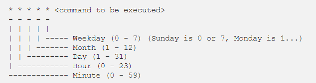

## 🔹 Повышение через SUID файлы

`SUID-бит (Set User ID)` - это специальное разрешение, которое может быть установлено на исполняемые файлы в операционной системе Linux. Когда SUID-бит установлен на файле, который принадлежит пользователю, при выполнении этого файла процесс наследует привилегии владельца файла, а не привилегии запустившего процесс пользователя. Это позволяет обычному пользователю временно получить повышенные привилегии, такие как привилегии суперпользователя (`root`).

Как найти `SUID-файлы`?

Используя утилиту поиска `find`, мы можем перечислить все двоичные файлы, имеющие разрешения SUID:

> find / -perm -u=s -type f 2>/dev/null

## 🔹 Повышение через ядро 

В первую очередь необходимо получить текущую информацию об операционной системе и ядре, чтобы найти все доступные эксплойты для ядра.

Ручное перечисление: Следующая команда может быть использована для ручного перечисления информации о ядре (Linux):

> uname -a ; lsb_release -a; cat /proc/version /etc/issue /etc/*-release; hostnamectl | grep Kernel

Автоматизированное перечисление: Автоматизированные сценарии перечисления, такие как LinPEAS, также могут быть использованы для перечисления информации об операционной системе и ядре. Для винды можно использовать WinPEAS.

## 🔹 Поиск доступных эксплойтов ядра

[Searchsploit](https://github.com/offensive-security/exploitdb) это инструмент поиска эксплоита в командной строке, в который включен репозиторий Exploit Database. Например, чтобы поискать эксплоиты для определенной версии линукс нужно:

> searchsploit linux kernel <версия ядра>

Затем их можно отразить с помощью SearchSploit, используя следующий синтаксис:

> searchsploit -m path/to/exploit/xxxx.c

Ну и никто не отменяет обычный поиск эксплоитов через гугл :)

## 🔹 Повышение привилегий в Linux-машинах - Cron

`Cron` — это планировщик заданий в операционных системах на базе `Unix`. Задания Cron используются для планирования задач путем выполнения команд в определенные даты и время на сервере.

По умолчанию Cron запускается от имени пользователя `root` при выполнении /etc/crontab, поэтому любые команды или сценарии, вызываемые crontab, также будут выполняться от имени пользователя root.

Используя скрипт LinEnum или LinPEAS, мы также можем собирать информацию о заданиях cron.

Например: внутри `crontab` мы можем добавить следующую запись для автоматической печати журналов ошибок Apache каждые 1 час.

> \*\*1 0\*\*\* printf \"\" > /var/log/apache/error_log\*\*

## 🔹 Синтаксис Cron

Не очень понятен пример ниже? Смотри на картинку снизу!

Первые пять полей могут содержать одно или несколько значений, разделенных запятой или диапазон значений, разделенных дефисом.

- \* - оператор звездочки означает любое значение или всегда. Если в поле «Час» имеется символ звездочки, это означает, что задание будет выполняться каждый час.
- , - оператор запятой позволяет указать список значений для повторения. Например, если у вас есть 1,3,5 в поле Час, задание будет выполняться в 1, 3 и 5 часов утра.
- \- - оператор дефиса позволяет указать диапазон значений. Если в поле «День недели» указано значение 1–5, задание будет выполняться каждый рабочий день (с понедельника по пятницу).
- / - оператор косой черты позволяет указать значения, которые будут повторяться в течение определенного интервала между ними. Например, если в поле «Час» указано */4, это означает, что действие будет выполняться каждые четыре часа. Это то же самое, что указание 0,4,8,12,16,20. Вместо звездочки перед оператором косой черты можно также использовать диапазон значений, 1-30⁄10 означает то же, что и 1,11,21. Общесистемные файлы Crontab Синтаксис общесистемных файлов crontab немного отличается от пользовательских crontabs. Он содержит дополнительное обязательное поле пользователя, которое указывает, какой пользователь будет запускать задание cron. -

## 🔹 Повышение привилегий линукс через пользовательские скрипты. 

Пользовательские скрипты, у которых есть права на запуск с более высокими привилегиями, чем у текущего пользователя, так же могут быть уязвимы к атакам категории `Command Injection`. Например:

> sudo -l

Когда вы выполняете команду `sudo -l`, система проверяет вашу учетную запись и отображает список команд или командных файлов, которые можно выполнить с повышенными привилегиями с помощью `sudo`. Это может включать команды, которые можно выполнять с правами администратора или любые другие команды, к которым у вас есть доступ.

## 🔹 Повышение привилегий в Windows.

В Windows, повышение привилегий связано с получением прав `администратора` или прав `системного администратора`. Это может быть достигнуто путем эксплуатации уязвимостей в операционной системе или встроенных приложениях. Повышение привилегий в Windows может быть более сложным из-за дополнительных механизмов безопасности, таких как `User Account Control (UAC)`, которые требуют подтверждения от пользователя для выполнения привилегированных действий.

## 🔹 Повышение привилегий с помощью небезопасных разрешений службы. 

> Служба в Windows - это приложение, автоматически исполняемое системой при запуске операционной системы Windows и выполняющиеся вне зависимости от статуса пользователя.

Повышение привилегий через данную технику возможно, когда служба работает с правами `СИСТЕМЫ`, но у пользователя есть разрешения на изменение пути к исполняемому файлу на тот, который может создать reverse shell.

Accesschk.exe предназначена для проверки и анализа разрешений доступа к файлам, реестру, службам и другим ресурсам операционной системы Windows. Утилита позволяет просматривать и сравнивать разрешения доступа на различных уровнях, включая уровень файла, реестра, службы и т. д.

> .\accesschk.exe /accepteula -uwcqv \<User\> \*

Компоненты команды:

- .\accesschk.exe - утилита AccessChk (запуск из текущей директории)
- /accepteula - автоматическое принятие лицензионного соглашения
- u - подавление выводы заголовков (terse mode)
- w - показывать только объекты с доступом на запись
- c - проверка служб (services) 
- q  - тихий режим (не показывать успешные доступы)
- v - verbose (подробный вывод)
- \<User\> - имя пользователя или группы для проверки
- \*- проверка всех объектов в системе

Потом для конкретной службы можно поменять путь исполняемого файла:

> sc config \<service name\> binpath= "\"C:\PrivEsc\reverse_shell.exe\""

Также поиск конкретной службы можно сделать с помощью следующей команды:

> cmd /c wmic service get name,displayname,pathname,startmode |findstr /i "auto" |findstr /i /v "c:\windows\\" |findstr /i /v ""”

Что мы ищем такой командой? Службы с автозапуском и расположенные вне системных папок (не в C:\Windows).

## 🔹 Слабые разрешения ключа в реестре

В качестве разведки можно использовать следующую команду с утилитой Accesschk:

> accesschk64.exe -kw hklm\System\CurrentControlSet\Services | more

- **`-k`** - проверка разделов реестра (registry keys)
- **`-w`** - показывать только объекты с доступом на **запись**
- **`hklm\System\CurrentControlSet\Services`** - ключ реестра со всеми службами Windows
- **`| more`** - постраничный вывод

> accesschk.exe /accepteula "Users" -kvuqsw hklm\System\CurrentControlSet\services

- **`-v`** - verbose (подробный вывод)
- **`-u`** - suppress headers (подавить заголовки)
- **`-q`** - quiet (не показывать успешные доступы)
- **`-s`** - рекурсивная проверка подразделов
- **`-w`** - только доступ на запись

Цель команды: найти службы, которые могут изменять обычные пользователи без привилегий.

## 🔹 Повышение привилегий через AlwaysInstallElevated

Установщик Windows — это утилита, которая с помощью пакетов `MSI` может устанавливать новое программное обеспечение. `AlwaysInstallElevated` — это политика Windows, которая позволяет непривилегированным пользователям устанавливать программное обеспечение с помощью пакетов MSI с разрешениями уровня `СИСТЕМЫ`, которые можно использовать для получения административного доступа к компьютеру с Windows.

Чтобы такая атака сработала нужно проверить включена ли политика AlwaysInstallElevated. 

В следующих раздела реестра она должна быть установлена на 1:

- `HKEY_CURRENT_USER\Software\Policies\Microsoft\Windows\Installer`
- `HKEY_LOCAL_MACHINE\Software\Policies\Microsoft\Windows\Installer`

Для проверки этого можно воспользоваться командой:

> reg query HKCU\SOFTWARE\Policies\Microsoft\Windows\Installer /v AlwaysInstallElevated

> reg query HKLM\SOFTWARE\Policies\Microsoft\Windows\Installer /v AlwaysInstallElevated

Также это можно проверить через утилиту, о которой мы говорили выше - WinPEAS

> winpeas.exe quiet systeminfo

Если данная политика включена, можно воспользоваться следующей командой для установки своего собственного пакета:

> msiexec /quiet /qn /i shell.msi

Ну и под конец конспекта поговорим о защите от угроз повышения привилегий в операционных системах Linux и Windows:

1. Обновляйте операционную систему и программное обеспечение: Регулярно устанавливайте все доступные обновления, которые включают исправления уязвимостей.
2. Используйте антивирусное программное обеспечение: Установите и регулярно обновляйте антивирусное программное обеспечение для обнаружения и блокировки вредоносных программ.
3. Ограничьте привилегии пользователей: Назначайте только необходимые привилегии пользователям и ограничивайте доступ к системным ресурсам. Используйте принцип наименьших привилегий, предоставляя пользователям только те права, которые им необходимы для выполнения своих задач.
4. Используйте многофакторную аутентификацию: Включите многофакторную аутентификацию для доступа к системе. Это поможет предотвратить несанкционированный доступ даже в случае компрометации учетных данных.
5. Мониторинг и аудит системы: Ведите постоянный мониторинг системы и регистрируйте все события, связанные с повышением привилегий.
6. Используйте сильные пароли: Убедитесь, что все пользователи используют сложные и уникальные пароли. Это поможет предотвратить несанкционированный доступ к учетным записям и потенциальное повышение привилегий.
7. Регулярно резервируйте данные: Регулярное создание резервных копий данных поможет минимизировать потерю информации при возможных атаках или сбоях системы.
