# Server Side уязвимости

В этом конспекте мы рассмотрим с вами основы server side уязвимостей!

[Видео-лекция](https://www.youtube.com/watch?v=UpBJIOk8eMA&t=7063s) по которой сделан конспект.

## 🔹 Client-Server Архитектура

Клиент серверная архитектура представляет собой цепочку из клиента (например веб-приложение), который обращается к серверу, а тот в свою очередь обращается к внутренним сервисам, например - базе данных.
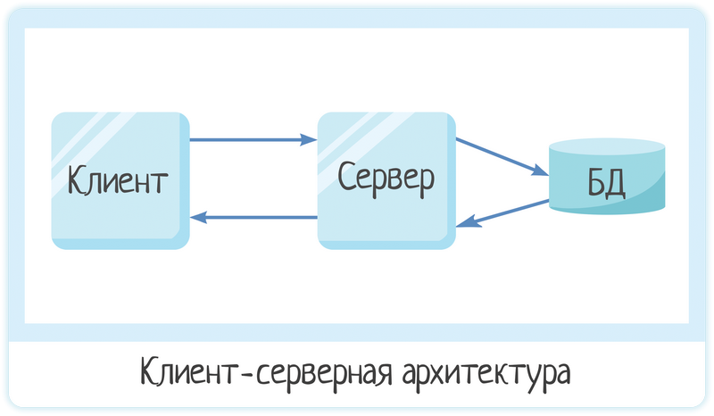

Можно немного усложнить эту схему, добавив балансировщики нагрузки.

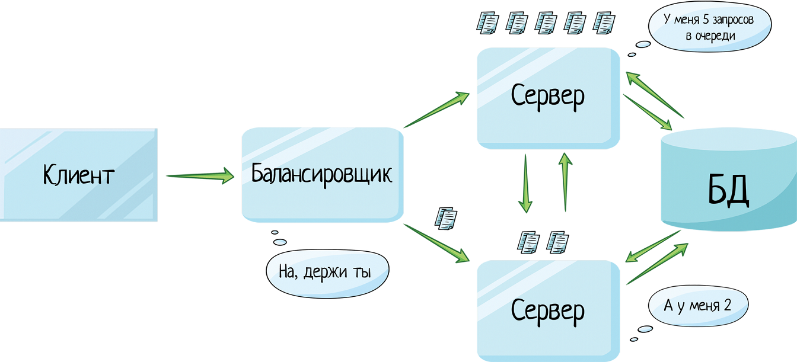

С архитектурой разобрались - теперь переходим непосредственно к самим уязвимостям! 

> Server-side уязвимости представляют собой слабости и недостатки, которые злоумышленники могут эксплуатировать на стороне веб-сервера.

Какие риски могут возникнуть при server-side уязвимостях?

1. Доступ к данным (персональные данные пользователей, исходные коды приложения)

2. Отказ в обслуживании (DoS, DDoS)

3. Повышение привилегий 

4. Исполнение кода на сервере

5. Полная компрометация 

## 🔹 Path Traversal

А теперь переходим к самим уязвимостям! И первая на очереди это path traversal.

> Path Traversal - это тип атаки, при которой злоумышленник пытается получить доступ к файлам и каталогам, к которым он не имеет разрешения, путем манипуляции пути файла.

Как происходит?

1. Вставляем ../
2. Обходим фильтры, если фильтрует 1 пункт

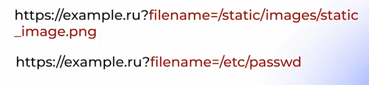

Или

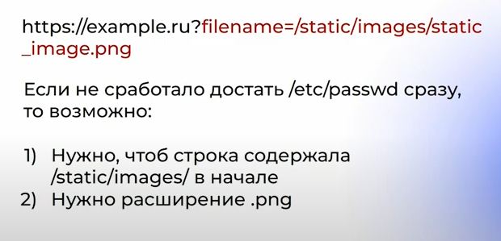

Еще пример path traversal, когда мы пытаемся получить информацию другого пользователя, даже если стоит ограничение доступа на просмотр чужих файлов.

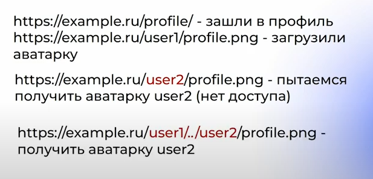

## 🔹 Устройство веб-сервера

Nginx - это веб сервер и обратный прокси-сервер с открытым исходным кодом. Что он умеет:

1) Балансировка нагрузки

2) Защита от DDoS атак

3) Обработка статического контента

4) Другие

А что по уязвимостям в Nginx? Некоторые серверы с nginx [остаются](https://labs.hakaioffsec.com/nginx-alias-traversal/) уязвимы для техники Nginx Alias Traversal, которая была [предложена](https://i.blackhat.com/us-18/Wed-August-8/us-18-Orange-Tsai-Breaking-Parser-Logic-Take-Your-Path-Normalization-Off-And-Pop-0days-Out-2.pdf) на конференции Blackhat ещё в 2018 году и позволяет получить доступ к файлам и каталогам, размещённым вне корневого каталога, заданного в директиве "alias". Проблема проявляется только в конфигурациях с директивой "alias", размещённой внутри блока "location", параметр которой не завершается на символ "/", в то время как "alias" завершается на "/".

Суть проблемы в том, что файлы для блоков с директивой alias отдаются через прикрепление запрошенного пути, после его сопоставления с маской из директивы location и вырезания заданной в этой маске части пути.

В конфигурациях, в которых значение директивы alias не завершается символом "/" (например, "alias /var/images;"), атакующий не может перейти в родительский каталог, но имеет возможность запросить другой каталог в /var, начало имени которого совпадает с указанным в конфигурации.

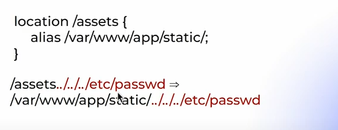

Такое сработает. Чтобы не сработало, нужно:

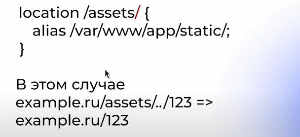

## 🔹 Path Traversal - URL Encode

URL-кодирование - это процесс замены некоторых символов в  URL-адресе их процентными кодами, что позволяет включать специальные символы в  URL. Это может помочь обойти фильтры.

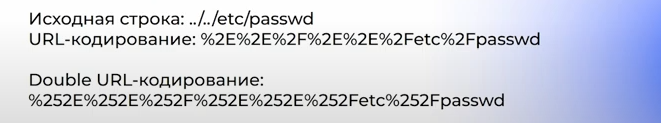

## 🔹 IDOR - Insecure Direct Object References

> IDOR - это тип уязвимости в веб-приложениях, при котором злоумышленник может получить доступ к объектам (например, файлам, записям в БД), на которые у него нет соответствующих прав доступа.

По хорошему все должно выглядеть вот так:

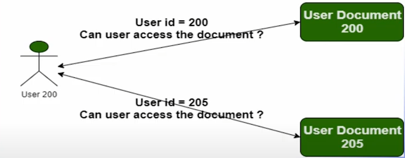

Но происходит вот так:

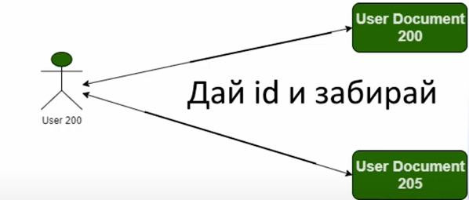

Пример IDOR'а:

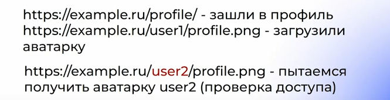

Как можно бороться с такой ситуацией? Например - в случае с названиями картинок. Называть файлы в uuid (**UUID (Universal Unique Identifier)** — это **128-битное значение, использующееся для уникальной идентификации объекта или сущности в интернете**). И хранить соответствие uuid и user в базе данных, чтобы можно было проверять доступ.

## 🔹 Проблемы аутентификации

Хороший механизм аутентификации должен содержать капчу, ограничение по количеству запросов за период времени, двух факторную ступень, капчу на двухфакторной ступени, ограничение на двухфакторной ступени. 

Также нужно позаботиться о решении такой проблемы как User Enumeration. То есть по ответу приложения не должно быть понятно существует ли пользователь в системе или нет. Сброс пароля должен происходить безопасно (не должны использоваться угадываемые ключи или ключи, которые легко забрутить).

После утечки, если такое произошло - необходимо сменить пароли всем пользователям. И установить сильную парольную политику - ну это вообще лучше сделать еще до утечки ;)

## 🔹 SSRF

> SSRF - это вид атаки на веб-приложения, при которой злоумышленник может заставить сервер выполнять запросы к внутренним ресурсам или внешним серверам.

Какой можно привести пример SSRF? Допустим, у нас есть сайт, который может ходить на разные ресурсы (url которых мы ему введем) и возвращать какую-то информацию. В качестве GET параметра он принимает url сайта. 

Строчка `?url = https://ya.ru` не вызовет у него никаких проблем. Но вот если приложение настроено не верно, то мы можем сходить например на `?url = http://localhost/vajnaya_localnya_informacia`. Что уже недопустимо. Это самый простой пример SSRF)

Как же бороться с SSRF? Добавляйте вайтлисты куда мы ходим ходить. Например - получать ролики только с ютуба. Использовать библиотеки для проверки ip адресов. Фильтровать куда мы ходим и куда прилетит конечный результат. Сделать ограничение доступа. 

## 🔹 CMD injection

> CMDinjection - это тип атаки, при которой злоумышленник внедряет и выполняет вредоносные команды в командной строке (CMD) или в консоли на сервере.

Какие же причины cmd инъекций? Самое простое - небезопасное использование функций языка программирования и вызывание команд прямо в ОС, вместо того, чтобы использовать какие-либо библиотеки, чтобы ограничить такие вызовы. Небезопасное использование системных вызовов, в которые мы можем внедрить инъекцию. И неверная обработка файлов и путей.

Простой пример - приложение, которое просто пингует сайт. Он принимает значение url.  Что может пойти не так?

`ping ya.ru` звучит безобидно и безопасно. Но вот прибавив к нашему входному значению команду `ls` мы получим `ping ya.ru;ls`, что выведет список файлов и папок в текущем каталоге. Крутяк!

Можно поставить ограничение на ввод пробелов. Но это также можно обойти заменив пробел на строку `${IFS}`, что системой будет восприниматься как вполне легитимный пробел. Или можно одну команду указывать в фигурных скобках и передавать аргументы через пробел - такое тоже сработает!

`ping ya.ru;{cat,secret.txt}`

Как решать? Воспринимать вводимое значение как единую сущность. Это можно сделать, например в Python, с помощью `subprocess.check_output`.

## 🔹 SSTI

> SSTI - уязвимость связанная с внедрением кода в серверные шаблоны. Эта уязвимость происходит, когда злоумышленник вводит в пользовательские данные код, который затем выполняется в контексте шаблонизатора на сервере.

Основной механизм SSTI заключается в том, что веб-приложение неправильно обрабатывает входные данные, предназначенные для использования в шаблонизаторе, и позволяет внедрять код вместо простых данных. Это нарушает синтаксис шаблона.

## 🔹 LFI (Local File Inclusion)

> LFI - это вид уязвимости веб-приложений, при которой злоумышленник может внедрить и выполнить файловые операции, обращаясь к локальным файлам на сервере.

Например вместо аватарки (файла `.png`), мы загружаем файл `reverse_shell.php` и потом обращаемся к нему, чтобы установить удаленное соединение. Почему приведен пример именно с php? Потому что `php` файлы являются исполняемыми для сервера.