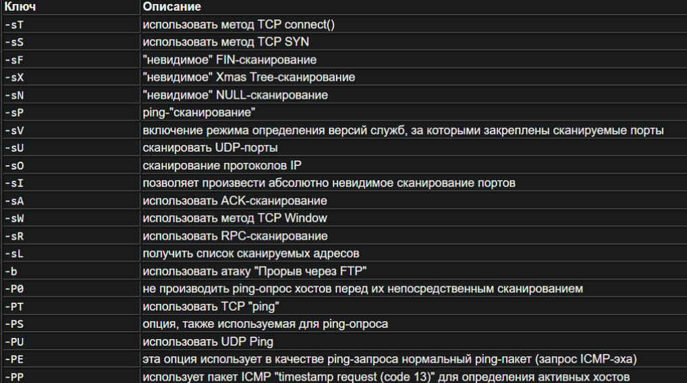

## 🔹 Опции nmap

> nmap scanme.nmap.org

Сканирует первые 1000 портов tcp

Если запустить сканирование с правами sudo, то будет произведено полное tcp syn сканирование 

> sudo nmap scanme.nmap.org

Популярные опции сканирования 

-sC - это сканирование с помощью стандартных скриптов инструмента. 

Если при таком запуске nmap пишет, что хост выглядит неживым - можно попробовать добавить опцию -Pn. Так nmap будет сканировать только те хосты, которые выглядят как живые. Без этой опции nmap сразу прерывает свою работу, когда видит упавший хост.

> nmap -sC scanme.nmap.org -Pn 

Также можно делать вызовы определенных скриптов nmap с различными аргументами. Делается это по такому шаблону:

> nmap --script=<Название скрипта>-nse --script-args <Аргумент1>=<Значение> <Аргумент2>=<Знаечние> <IP-адрес/хост>

С помощью опции -sV можно выявить версии сервисов на обнаруженных открытых портах.

В качестве альтернативы опции -sV можно использовать опцию -A. Она помимо определения версий сервисов на портах также определяет тип операционной системы.

Также с помощью nmap результаты сканирования можно сохранить в файл - это особенно полезно, если вы выполняете какое-то глубокое и подробное сканирование, чтобы после не выполнять его повторно, если консоль будет очищена. Для этого нужно использовать опцию -oN и после нее указать название файла, куда будет сохранен результат.

> nmap scanme.nmap.org -oN nmap.out

С помощью опции -p можно указать какие порты нужно сканировать.

Например:

> nmap -p 1-100 scanme.nmap.org

А чтобы отсканировать абсолютно все порты, нужно:

> nmap -p- scanme.nmap.org

Можно также указать, какие именно порты нужно отсканировать:

> nmap -sC -sV scanme.nmap.org -p 18500, 18522 

Все наиболее важные опции nmap:

## 🔹 Gobuster

Шаблон для использования gobuster для поиска 

> gobuster dir -w <путь до вашего wordlist> -u http://localhost:8000/ -x <расширение файлов которые мы ищем - можно несколько через запятую> -t <количество потоков - при большом количестве может сработать антиддос защита, лучше брать 3>

## 🔹 Wfuzz

Wfuzz - это аналог gobuster, через него тоже можно фазить скрытые директории и файлы. Но в отличие от gubuster, тут нельзя задать место куда будут подставлять значения из словаря. Шаблон для wfuzz:

> wfuzz -c -t <работа в одном потоке>1 --hc 403,404 -w <путь до вашего wordlist> http://localhost:8000/FUZZ.php

